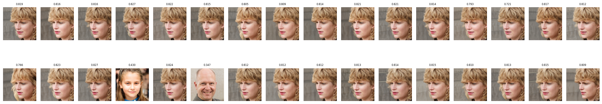
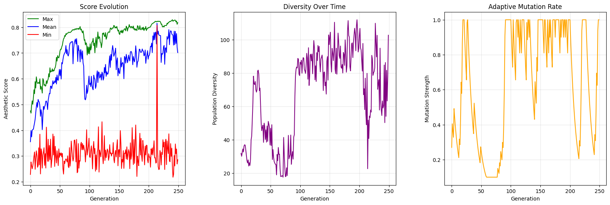
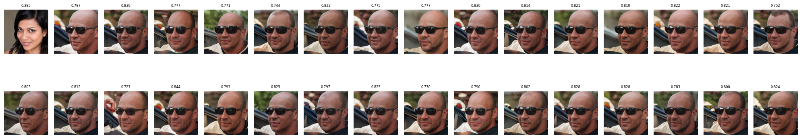
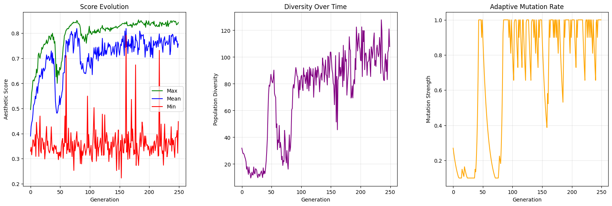

# CLIP-GAN-Evolution

A genetic optimization system that evolves StyleGAN latent vectors to generate increasingly aesthetic images using CLIP embeddings for evaluation.

**Key terms: genetic algorithm, StyleGAN2-ADA, CLIP, latent space optimization, aesthetic prediction, adaptive mutation, crossover strategies, population diversity**

## Core Components:

**StyleGAN Generator:**
- Uses NVIDIA's StyleGAN2-ADA for generating high-quality face images
- Works with pre-trained model weights for realistic face generation
- Operates in the GAN's latent space (Z-dim) with truncation and noise control

**CLIP Aesthetic Predictor:**
- Leverages OpenAI's CLIP model for image-text similarity scoring
- Uses text prompts ranging from "extremely unattractive" to "exceptionally beautiful"
- Calculates aesthetic scores between 0-1 based on CLIP embeddings

**Genetic Optimizer:**
- Population size: 32 individuals, 8 parents per generation
- Adaptive mutation rates (0.05-0.5) based on population diversity
- Multiple mutation strategies:
  - Gaussian noise
  - Uniform noise
  - Targeted feature changes
- Crossover methods:
  - Interpolation
  - Feature swapping
  - Weighted averaging

## Performance:

- Aesthetic scores typically improve from 0.49 to 0.58+ over 150 generations
- Maintains realistic face features while optimizing for aesthetics
- Successfully generalizes to different text prompts (e.g., "Dominic Toretto", "Taylor Swift")

## Training:

The system implements:
- Dynamic mutation strength adjustment
- Population diversity tracking
- Score-based parent selection
- Batch processing for efficient evaluation
- Progress visualization with metrics plotting

## Results Visualization:

- Real-time display of population images
- Generation-by-generation score tracking
- Population diversity metrics
- Mutation rate adaptation graphs
- Best candidate saving and visualization

Total implementation includes approximately 500 lines of PyTorch code, utilizing CUDA acceleration when available.

## Taylor Swift Optimization Results:

## Dominic Toretto Optimization Results:

